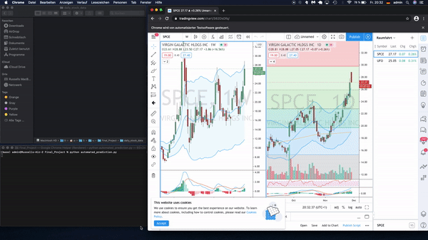
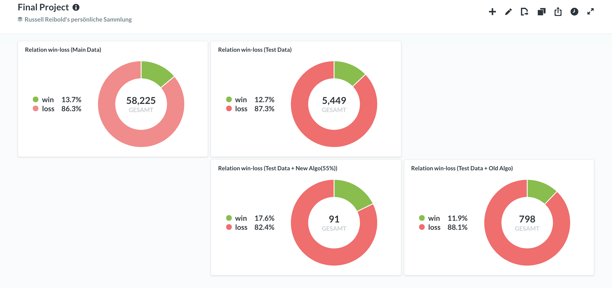
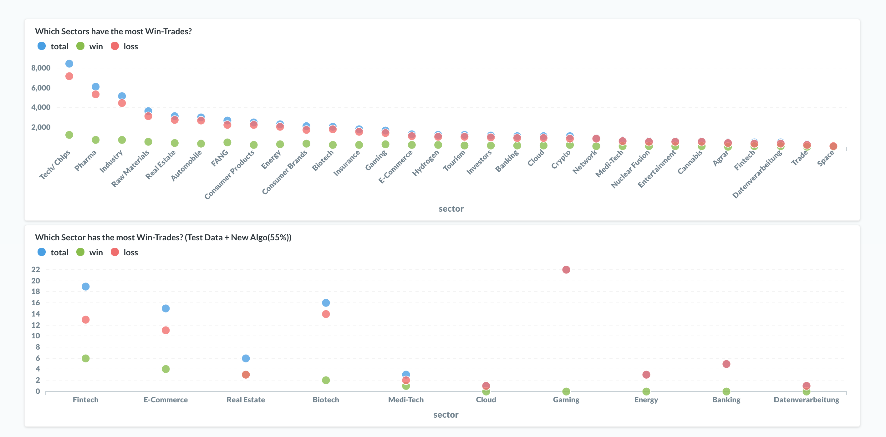
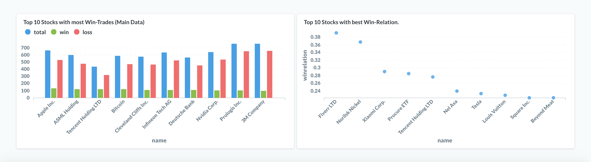

# automated_stock_prediction
The goal of my final project work was to create a machine learning model, based on data from 130 stocks over the last 14 years, which is able to recognize patterns in price movements and make predictions.
## Demo Web Scrapping

## Problem
One of the problems with stock analysis is the large number of companies to analyze. The New York Stock Exchange alone lists about 3000 companies. Even if you have put together an investment strategy, be it based on fundamental data, sentiment or technical analysis, you still end up with the problem of having to run your analysis across all the tradable stocks.
## Solution
So I developed an algorithm that is able to analyze the technical data of any number of stocks, recognize predefined patterns and, with the help of a machine learning model, make a prediction about the price trend.
### Concept

The final idea looks like this. First, a cloud computing machine is created in this case an AWS EC2 machine. The python script then runs on it, which pulls the technical data and does an analysis. The script has a crontab that starts the script every day at the same time. When the script has run, potential trades are emailed to the recipient. The mail contains the stocks that have a potential opportunity and an indication of the probability that the trade would lead to a profit.

Also runs on the EC2 machine metabase. Metabase gives insights on sectors and individual stocks. This helps to make a decision about the risk. Metabase + the probability therefore represent a risk management tool.

## License
[MIT](https://choosealicense.com/licenses/mit/)
